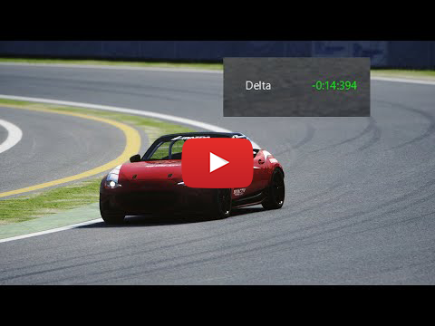

# Track-Sectors-Assetto-Corsa-App

Ever wanted to improve your time on a track, but never managed to pinpoint where you were fast and where you were slow? This app solves the problem. It let's you create N sectors on a track and record your times.

[RACEDEPARTMENT LINK](https://www.racedepartment.com/downloads/track-sectors-divide-the-track-in-sections.43904/)

Video Demonstration :

How To Use - Please READ:

Select how many sectors you want to use, then simply press the button for each respective sector where you want to set the end of the sector. After configuring all your sectors, go to pits, then you can start recording times.

This procedure of going to pits is not mandatory every time, only when setting up/resetting a track configuration, if the configuration is already made for the current track, the app will record your times naturally.

Requirements

- at least version 1.78 of custom shaders patch (CSP)

- track has an implemented AI Line

- game must be live, not in a replay

The app will check by itself all these conditions when starting and will leave an appropriate message if a condition is not met.

Notes regarding how the app works:

- sectors must be placed in a consecutive manner in terms of track progression, eg: sector 2 is placed at the end of the 5th corner, then sector 3 must be placed further ahead, for example at corner 7.

- can not place sectors in pit/pit lane

- changing the configuration of an already configured track will delete all the stored data about that track, including times for cars that you drove on the track.

- the app makes backups of the data file and stores the last 10 assetto corsa sessions. This feature is just in case you change a track configuration by mistake.

    If you want to restore a backup, simply go into the app's folder>data>backups and copy from there whatever backup you desire and paste it to app's folder>data and let it overwrite the current file.

- buttons will flash red to let you know that some conditions are not met. Such as trying to set a sector in pits or trying to set a sector while in a replay, would flash it red.

I highly suggest reading the User Manual PDF file, found inside the zip archive, to understand everything that the app offers.

Update 1.4

- completely rewritten the app from 0, making it modular by using OOP and functional programming paradigms, easier to change/manage or add new functionalities

- added support for track layouts (meaning you can for example have separate configurations for nordschleife tourist while also having a configuration for nordschleife endurance)

- the program will make backups of the file that stores data about track config and car times, it will retain the latest 10 backups and delete backups older than that

- updated the app icon

- added exit/close buttons

- the dictionary that stores the data is now ordered, making it human-readable

- moved the ability to change the UI layout from the settings app to the main app

- can now directly set up the last sector to be equal to the finish line.

- can show your total time of all your sectors and your theoretical best lap time, by summing up the best times you have on every sector.

- works in all types of sessions now: practice, hotlap, time attack, race, track day, weekend, qualifying

- all app settings can now be changed from content manager's app tab

- the app has now a fully customizable opacity slider

- the auto next page function has now become on by default

- you can now change the delay until the app switches to the next page after clearing all the sectors on the current page

- you can store partial car times, example: you cleared 2 sectors out of 6, the program will now save the times for those 2 sectors, unlike in the previous version
where you had to go through all sectors for the car times to be saved

- the sector you're currently on is now colored in an orange color, instead of blue, since it was too hard to see before.

- fixed possible sim_info library conflict with other apps (there would be some cases where some apps would load into memory an older sim_info library after my app, resulting in errors
due to missing functions that were not available in those older versions)

Contributions:
- Stereo - helping me with making the button function modular

- Nache - providing help in solving various logistic problems

\
Related docs:
- [Track Sectors User Manual.pdf](https://github.com/RuseCristian/Track-Sectors-Assetto-Corsa-App/files/10046798/Track.Sectors.User.Manual.pdf)

- [Technical Explainations.pdf](https://github.com/RuseCristian/Track-Sectors-Assetto-Corsa-App/files/10046803/Technical.Explainations.pdf)

